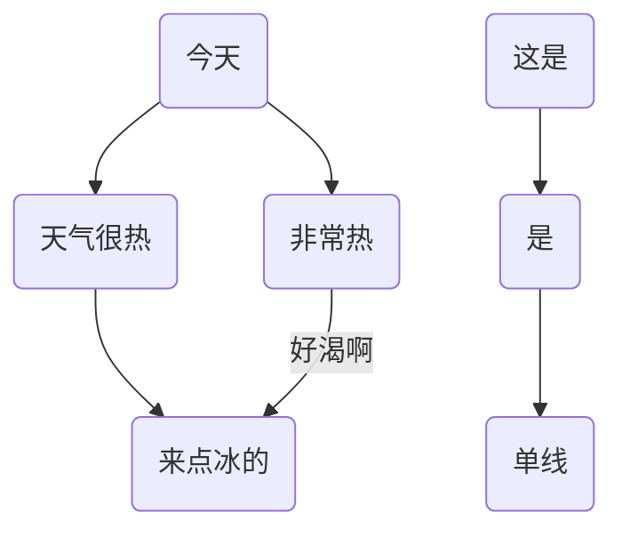
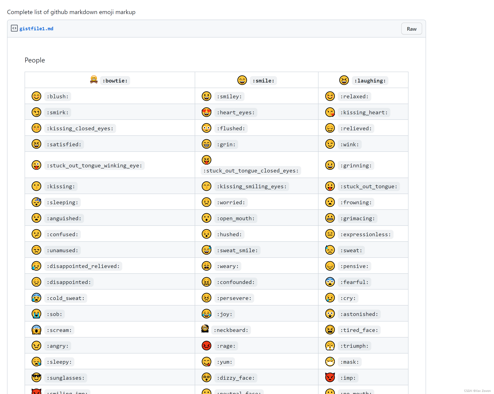

#### 标题md

>在想要设为标题文本前，加‘#’，一级标题加1个‘#’，二级标题加2个，最多为6级

```
# 一级标题
## 二级标题
### 三级标题

.....
```

#### 斜体

>在文本两端各加一个星号‘*’ __或者__ 各加一个英文版下划线‘_’

*斜体*
_斜体_

#### 加粗

>在文本两端各加两个星号‘**’__或者__ 各加两个英文版下划线‘__’

**加粗**
__加粗__

#### 斜体加粗

>在文本两端各加三个星号‘***’__或者__ 各加三个英文版下划线‘___’

***斜体加粗***
___斜体加粗___

#### 删除线

>在文本两端各加两个‘~~’

~~删除线~~

#### 下划线

<u>下划线</u>

#### 分割线

>用三个或三个以上的‘-’或者‘*’，如下：

---

***

#### 引用

>用‘>’+ 空格，也可以嵌套使用，如下：

> 引用演示

>嵌套演示一层
>>二层
>>>三层


#### 列表（有序&无序）

>有序列表：输入1. 加一个空格（注意有‘.’）按回车健会自动补全编号

1. 11
2. 11
   1. 22
   2. 22
      3. 33
      4. 33

>无序列表：输入星号‘*’ 加空格 __或者__ 输入加号‘+’ 加空格 __或者__ 输入减号‘-’ 加空格

* 11
* 11
  + 22
  + 22
    - 33
    - 33

#### 插入图片

```
 
```

#### 表格

>第一行是表头，以‘|’区分列
>第二行是对齐方式，‘-’表示默认对其即左对齐，在‘-’左侧加 ‘:’为左对齐，在‘-’右侧加 ‘:’为右对齐，两边都加‘：’为居中对齐（‘-’的数量可随意，‘:’用英文字符！）

|默认对齐（左对齐）|居中对齐|右对齐|
| - |:---:|-----:| 
|1|2|3|

#### 链接

>直接复制链接

https://www.baidu.com/

>文字链接的方式如下

[链接说明](https://www.baidu.com/)

#### 代码

>单行代码：用反引号包起来

`daimakuai`

>代码快：用两行‘ ``` ’包裹起来，在第一行输入所用语言名字可指定语言提供提亮，如下：

```js
int a=0
```

```vue（什么代码快就写什么名称，比如：js，bash等）
代码块
```

#### 流程图



#### 文字

##### 文字背景（font+background）

###### 纯颜色背景

>写文字的时候，哪里需要添加背景，就用英文反引号‘ `` ’包裹起来，如下：

`就像这样`

>背景高亮，可以左右分别用两个‘==’包裹，如下：

==背景高亮==

>用font标签+样式语法也可以实现，而且背景可以多种多样哦~， 如下:

<font style='background:skyblue'>用英文单词控制背景</font>

<font style='background:#FF00BB'>也可以用十六进制控制背景</font>

<font style='background:rgb(0,0,0)'>也可以用rgb控制背景</font>

>也可以借助table标签来设置背景

<table><tr><td bgcolor=orange> 橘色 orange</td></tr></table>

<table><tr><td bgcolor= BlueViolet > 紫色 BlueViolet </td></tr></table>

###### 图片背景

<font style='background: url("https://img0.baidu.com/it/u=3342050756,1076278459&fm=253&fmt=auto&app=138&f=JPEG?w=678&h=500") '>图片背景,写多点，效果应该能出来，哇哦~ ，是我们天蝎座的紫色耶~~</font>

###### 渐变背景

<font style="background: linear-gradient( to right, #ff1616, #ff7716, #ffdc16, #36c945, #10a5ce, #0f0096, #a51eff, #ff1616);">渐变背景，越长越好看耶~</font>

##### 文字颜色(font+color)

<font color='skyblue'>用英文单词控制字体颜色,加不加引号都行，下面有不加引号引入的</font>

<font style='color:#FF00BB'>也可以用十六进制控制字体颜色</font>

<font color= rgb(0,0,0)>也可以用rgb控制背景</font>

##### 文字大小（font+size）

<font size="1">size为1</font>

<font size="3">md默认size为3</font>

<font size="5">size为5</font>

##### 文字字体（font+face）

<font face="黑体">我是黑体字</font>

<font FACE="宋体">我是宋体字,face大小写都可以</font>

<font face="微软雅黑">我是微软雅黑</font>

#### 任务列表

>[]用空格隔不隔开，效果不同，如下：

- [ ] java
- [x] vue
- [ ] react

#### 表情

>英文 :+单词+:，如下：

:smile:
:joy:
:cry:

表情参考图片：

具体参考网址：https://gist.github.com/rxaviers/7360908


