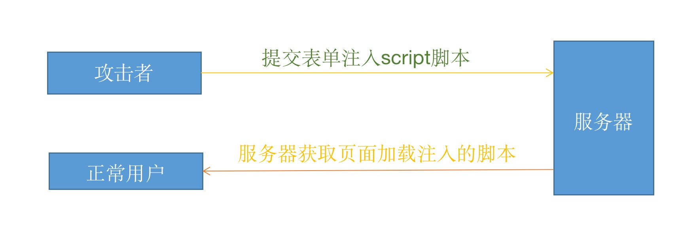

# XSS 攻击

## 简单介绍

> 跨站脚本攻击（Cross Site Scripting）缩写为CSS，但这会与层叠样式表（Cascading Style Sheets，CSS）的缩写混淆。因此将跨站脚本攻击缩写为XSS。
>
> 是指攻击者利用网络的漏洞，在表单提交时，在表单内容中加入一些恶意脚本，当其他正常用户浏览页面，而页面中刚好出现攻击者的恶意脚本时，脚本被执行，从而使得页面遭到破坏，或者用户信息被窃取。

## 防御方式

服务器端对用户提交的内容进行过滤或编码
1. 过滤:去掉一些危险的标签，去掉一些危险的属性
2. 编码:对危险的标签进行HTML实体编码

## 面试题

>介绍XSS攻击?
>
>参考答案:
>
>XSS是指跨站脚本攻击。攻击者利用站点的漏洞，在表单提交时，在表单内容中加入一些恶意脚本，当其他正常用户浏览页面，而页面中刚好出现攻击者的恶意脚本时，脚本被执行，从而使得页面遭到破坏，或者用户信息被窃取。
>要防范XSS攻击，需要在服务器端过滤脚本代码，将一些危险的元素和属性去掉或对元素进行HTML实体编码。

