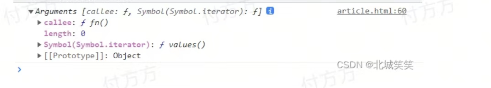
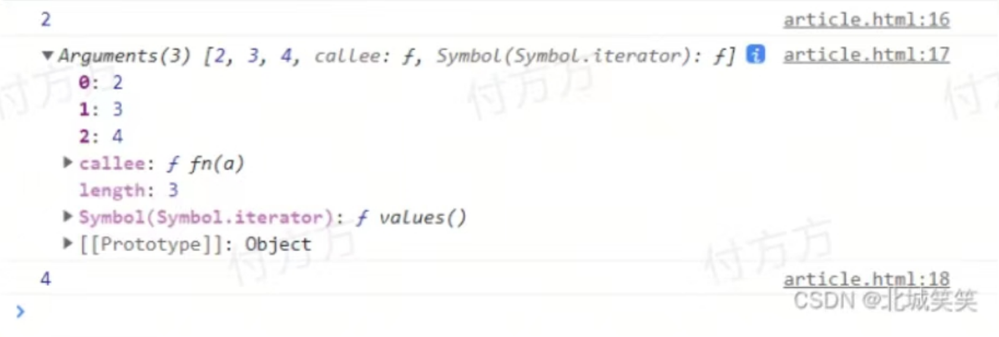

##### arguments

--每个函数都有一个特殊的对象参数叫arguments，这个对象包含了函数被调用时传递进来的所有参数。

##### 函数的默认参数

```js
 function fn() {
 console.log(arguments);
 }
 fn()
```



##### 当函数参数只有一个时

```js
 function fn(a){
 console.log(a);//2
 console.log(arguments[0]);//2
 }
 fn(2)
```

##### 当我们传递的实参个数大于形参的个数时

```js
 function fn(a) {
 console.log(a);//2
 console.log(arguments);
 console.log(arguments[2]);//4
 }
 fn(2, 3, 4)
```



可以看到，在我们没有使用形参接收参数时，在函数内部依然可以使用arguments来获取到实参数据。arguments接受到传递过来的所有数据，把他们都给装进了一个数组里，并且可以通过索引拿到相应的值，索引从0开始。

##### 当我们传递的实参个数小于形参的个数时

```js
 function fn(a, b) {
 console.log(a);//1
 console.log(b);//undefined
 console.log(arguments[0]);//1
 console.log(arguments[1]);//undefined
 }
 fn(1);
```

可以看到，在没有传递实参时，在函数内部使用对应的形参和arguments都是undefined；

##### 当我们传递的实参个数小于形参的个数且给多出的形参赋值

```js
 function fn(a, b) {
 b = 7;
 console.log(a);//1
 console.log(b);//7
 console.log(arguments[0]);//1
 console.log(arguments[1]);//undefined
 }
 fn(1);
```

当我们传递的实参个数小于形参的个数时，赋值的形参值被改变，不会影响arguments对象，因为arguments对象的大小是由传入的实参的个数决定的，并不是由定义的命名参数的个数决定的，没有传递值的形参将会自动被赋予undefined值，跟没有定义直接使用一样.

##### 当我们给形参赋值时

```js
// 非严格模式下
 function fn(a) {
 a = 5;
 console.log(a);//5
 console.log(arguments[0]);//5
 }
 fn(2, 3, 4);
// 严格模式下是5 2
```

##### 修改arguments

```js
// 非严格模式下
 function fn(a) {
 arguments[0] = 6;
 console.log(a);//6
 console.log(arguments[0]);//6
 }
 fn(2, 3, 4);
//严格模式下是2  6
```

可以看到，非严格模式下通过修改形参的值和arguments的值，不管改的是两者中的哪一个，都会影响对应双方的值；严格模式下，互相不影响。

>总结：

1、每一个函数，都有一个默认参数，参数是一个数组形式的arguments对象，可以通过数组下标来获取到对应的值。

2、当我们传递的实参个数大于形参的个数时，依然可以通过arguments获取到对应的实参数据，而且修改形参对应的值，arguments的值也会更新，反之亦然。