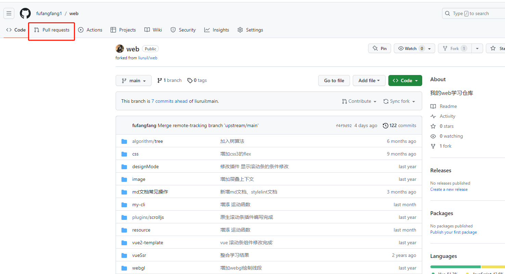
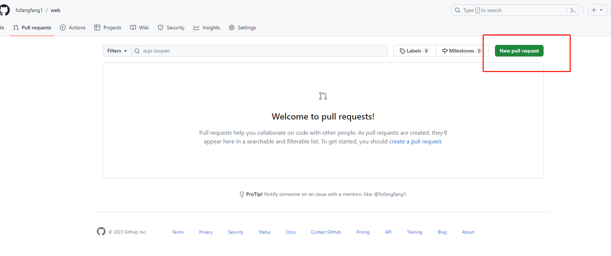
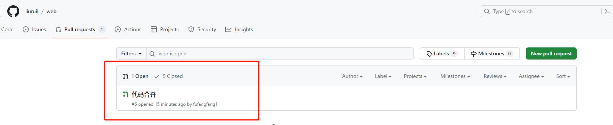

#### Git上fork后的代码仓库如何与原仓库进行同步

>第一步：复制项目到自己的仓库

在原项目的地址，比如https://gitee.com/A/xxxx.git 上，点击fork按钮，即将项目复制到了自己的仓库中，地址是https://gitee.com/B/xxxx.git

>第二步：下载项目到本地

下载到本地的项目会有一个默认的远程名origin，但这个远程名并不指向A仓库，而是指向自己fork的B仓库，也就是说之后进行的pull、push操作都是在B仓库上进行的。这个时候就需要将A、B两个仓库进行关联了。

>第三步：关联两个仓库

1. 执行命令git remote -v 查看远程仓库路径，如果只返回了两行结果，说明这时A、B两个仓库还未进行关联。

```bash
origin https://gitee.com/B/xxxx.git (fetch)
origin https://gitee.com/B/xxxx.git (push)
```
2. 执行命令git remote add upstream https://gitee.com/A/xxxx.git 将A仓库设为B的上游代码库，upstream的名称可以随便取，写abc也可以，之后B就用upstream这个名字与A进行联系。再次查看远程仓库路径，检查是否设置成功

```bash
upstream https://gitee.com/A/xxxx.git (fetch)
upstream https://gitee.com/A/xxxx.git (push)
origin https://gitee.com/B/xxxx.git (fetch)
origin https://gitee.com/B/xxxx.git (push)
```

>第四步：拉取合并代码

执行命令git fetch upstream获取A上的更新（此时并不会修改本地代码）。然后执行git merge upstream/master将代码合并到自己的master分支上。或者直接使用git pull upstream master命令。

>第五步：push代码到fork的仓库

通过之前的操作，只是将自己的本地库和原来的远程库进行了同步，所以还需要将fork的仓库也进行同步才行。git push origin master，将代码push到B仓库，到这里才算将代码全部同步。

#### 将远程仓库的代码提交到上游仓库

>第一步：进入GitHub账号的远程仓库，此时已经能够看到刚刚从本地仓库提交的修改了，然后点击New pull request





>第二步：进入结果对比页面，如下图所示：


可以看到从远程库的master分支向上游仓库的master分支申请提交代码。

Able to merge代表你的代码与上游代码没有冲突，可以提交

>第三步：点击 create pull request，进入下面页面：


填写注释，描述你所作的修改，然后点击右下角提交。

然后进入上游仓库的地址可查看，在上游仓库的Pull requests列表里就可以看到自己的提交请求了，等待作者审核即可。

