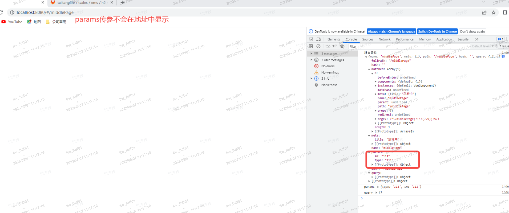

#### 对于params和query的理解

- 路由传参分为 __params__ 传参与 **query** 传参

- params 传参类似于网络请求中的 post 请求，params 传过去的参数不会显示在地址栏中（而且刷新里面是参数就没了）。params 要配合 name 使用。
- query 传参类似于网络请求中的 get 请求，query 传过去的参数会拼接在地址栏中（?name=xx）。query 较为灵活既可以配合 path 使用，也能配合 name 使用。

>name是什么呢？
name 是配置路由时给 path 取的别名，方便使用。但要注意的是 “地址栏显示的路径始终是 path 的值”。

>请看路由案例

```js

const routes=[
    {
        path:'/home',
        name:'home',
        component:HomeView
    }
]

```

#### params传参

>通过router-link to 以对象的形式跳转

```vue

<!-- params传参，可以有path（只是path不起作用），但是不能没有name -->
 <router-link :to="{ path: '/middlePage', name: 'middlePage', params: { type: '111', sn: '111' } }">传参</router-link>

```

>通过this.$router.push

```vue
 <template>
  <div>
    <button @click="junp">跳转</button>
  </div>
</template>
 <script>
export default {
  methods: {
    junp() {
      this.$router.push({
        // 有没有path都可以，它不起作用，但一定要有name
        path: '/middlePage',
        name: 'middlePage',
        params: {
          type: 111,
          sn: 111
        }
      })
    }
  }
}
</script>

```



#### query传参

>通过router-link to 以对象的形式跳转

```vue
<!-- query传参，既可以配合path，又可以配合name， -->
 <router-link :to="{ path: '/middlePage', name: 'middlePage', query: { type: '111', sn: '111' } }">传参</router-link>

```

>通过this.$router.push

```vue
<template>
  <div>
    <button @click="junp">跳转</button>
  </div>
</template>
 <script>
export default {
  methods: {
    junp() {
      this.$router.push({
        path: '/middlePage',
        query: {
          type: 111,
          sn: 111
        }
      })
    }
  }
}
</script>

```


#### 取参数

>打印参数用到的代码

```js
  created() {
    const router = this.$route
    console.log('路由参数', router)
    const params = this.$route.params
    console.log('params参数', params)
    const query = this.$route.query
    console.log('query参数', query)

  }

```

#### 解决params传参，刷新页面，参数丢失的问题

>params 传参后，刷新页面会失去拿到的参数。所以路由参数要修改为 '/home/:type/:sn'（官方称为动态路由）

>请看路由案例

```js

const routes=[
    {
        path:'/home/:type/:sn',
        name:'home',
        component:HomeView
    }
]

```

然后以上面同样的方式，params传参，地址栏会变成如图所示，而且刷新不会消失。


