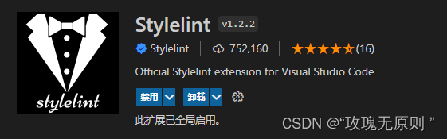

### 有关简介

Stylelint 是一个强大、先进的 CSS 代码检查器（linter），可以帮助你规避 CSS 代码中的错误并保持一致的编码风格。

### 亮点
Stylelint 的强大源于：

- 拥有超过 __170 条内置规则__ 赖检查最新的 CSS 语法和功能

- 支持 __插件__ 以创建你自己的规则

- 自动 **修复** 大多数代码格式上的问题

- 经过 15000 多次的 __充分的单元测试__

- 支持扩展或创建 __可共享的配置__

- __非强制约束（unopinionated）__，可根据你自己的需求进行自定义

- 像 Prettier 一样可以 __美化打印__ 效果

- 拥有一个 __不断增长的社区__，并且被 Google、GitHub 和 WordPress 所使用

还可以被扩展为：

- 解析 __类似 CSS 的语法__，例如 SCSS、Sass、Less 以及 SugarSS

- 能够从 HTML、Markdown 和 CSS-in-JS 对象以及模板文本中提取 __内嵌的样式代码__

### OK,废话少说，直接进入正题！

#### vscode 安装插件



>setting.json中的配置

```json
{
 // 开启stylelint自动修复
 "editor.codeActionsOnSave": {
 "source.fixAll": true,//开启自动修复
 "source.fixAll.eslint": true, //eslint保存的时候触发
 "source.fixAll.stylelint": true //stylelint保存的时候触发
 },
 "editor.formatOnSave": true,//开启保存的时候自动格式化
 "editor.defaultFormatter": "esbenp.prettier-vscode",//指定格式化的插件为Prettier
 "[vue]": {//局部设置，优先级较高，此处的局部设置，是防止用户区设置干扰到工作区设置
 "editor.defaultFormatter": "esbenp.prettier-vscode"
 },
 // 配置stylelint检查的文件类型范围
 "stylelint.validate": [
 "css",
 "less",
 "postcss",
 "scss",
 "sass",
 "vue"
 ],
 "stylelint.enable": true,//开启stylelint
}

```

#### 相关依赖包


| 依赖 | 作用描述 |
|---|----|
|stylelint|stylelint 核心库|
|stylelint-config-html|Stylelint 的可共享 HTML（和类似 HTML）配置，捆绑 postcss-html 并对其进行配置。|
|stylelint-config-recommended-scss|扩展 stylelint-config-recommended 共享配置，并为 SCSS 配置其规则|
|stylelint-config-recommended-vue|扩展 stylelint-config-recommended 共享配置，并为 Vue 配置其规则|
|stylelint-config-standard或stylelint-config-recommended|打开额外的规则来执行在规范和一些 CSS 样式指南中发现的通用约定，包括：惯用 CSS 原则，谷歌的 CSS 样式指南，Airbnb 的样式指南，和 @mdo 的代码指南。|
|stylelint-config-standard-scss| 针对scss的标准可共享配置。与stylelint-scss配合使用|
|stylelint-config-recess-order或stylelint-order|属性的排序（插件包）|
|stylelint-config-prettier|关闭所有不必要的或可能与 Prettier 冲突的规则|
|postcss|用于postcss-html和postcss-scss的支持|
|postcss-html|解析`<style>`类 vue、html 文件标签中的样式|
|postcss-scss|解析`<style lang='scss'>`下的scss样式|
|stylelint-config-rational-order|针对css属性排序的共享规则配置，避免长串css属性顺序规则书写。与stylelint-order配合使用|
|stylelint-less|配置stylelint less拓展插件|
|stylelint-scss|配置stylelint sass/scss拓展插件|

#### 按需配置

>在package.json的scripts中配置

```json
 "scripts": {
// .....省略其他
 "lint:stylelint": "stylelint --cache --fix \"**/*.{html,vue,css,scss}\" --cache --cache-location node_modules/.cache/stylelint/",
 // 或者
 "stylelint": "stylelint src/**/*.{css,less,vue,scss}"

 },


```

#### 配置stylelint

项目根目录创建配置文件stylelint.config.js 或 .stylelintrc.json

```js
// 参考配置

module.exports = {
 root: true,
 extends: [
 // 下载插件不一定用这么多，要看自己需要什么，当然rules也要做相应的修改。
 "stylelint-config-standard", // 配置 stylelint 拓展插件
 "stylelint-config-html/vue", // 配置 vue 中 template 样式格式化
 "stylelint-config-standard-scss", // 配置 stylelint scss 插件
 "stylelint-config-recommended-vue/scss", // 配置 vue 中 scss 样式格式化
 "stylelint-config-recess-order", // 配置 stylelint css 属性书写顺序插件,
 "stylelint-config-prettier", // 配置 stylelint 和 prettier 兼容
 ],
 plugins: ["stylelint-order", "stylelint-prettier", "stylelint-scss"],
 overrides: [
 // 扫描 .vue/html/css 文件中的 <style> 标签内的样式
 {
 files: ["**/*.(css|html|vue)"],
 customSyntax: "postcss-html"
 },
 {
 // css 相关文件由 postcss-scss 处理
 files: ["*.scss", "**/*.scss"],
 customSyntax: "postcss-scss",
 extends: [
 "stylelint-config-standard-scss",
 "stylelint-config-recommended-vue/scss"
 ]
 }
 ],
 rules: {
 indentation: null, // 指定缩进空格
 "scss/at-import-partial-extension": null, // 解决不能使用 @import 引入 scss 文件
 "selector-class-pattern": null, // 强制选择器类名的格式
 "function-url-quotes": "always", // URL 的引号 "always(必须加上引号)"|"never(没有引号)"
 "string-quotes": "double", // 指定字符串使用单引号或双引号 "single(单引号)"|"double(双引号)"
 "unit-case": "lower", // 指定单位的大小写 "lower(全小写)"|"upper(全大写)"
 "color-hex-case": "lower", // 指定 16 进制颜色的大小写 "lower(全小写)"|"upper(全大写)"
 "color-hex-length": "long", // 指定 16 进制颜色的简写或扩写 "short(16进制简写)"|"long(16进制扩写)"
 "rule-empty-line-before": "never", // 要求或禁止在规则之前的空行 "always(规则之前必须始终有一个空行)"|"never(规则前绝不能有空行)"|"always-multi-line(多行规则之前必须始终有一个空行)"|"never-multi-line(多行规则之前绝不能有空行)"
 "block-opening-brace-space-before": "always", // 要求在块的开大括号之前必须有一个空格或不能有空白符 "always(大括号前必须始终有一个空格)"|"never(左大括号之前绝不能有空格)"|"always-single-line(在单行块中的左大括号之前必须始终有一个空格)"|"never-single-line(在单行块中的左大括号之前绝不能有空格)"|"always-multi-line(在多行块中，左大括号之前必须始终有一个空格)"|"never-multi-line(多行块中的左大括号之前绝不能有空格)"
 "no-empty-source": null, // 禁止空源码（就是写了一个大括号，然后里面啥也没写）
 "property-no-unknown": null, // 禁止未知的属性
 "no-descending-specificity": null, //设置允许低优先级的选择器出现在高优先级的选择器之后
 'font-family-no-missing-generic-family-keyword': null, // 设置允许定义非"generic-family"风格字体
 "value-keyword-case": null, // 解决在 scss 中使用 v-bind 大写单词报错
 "value-no-vendor-prefix": null, // 关闭 vendor-prefix (为了解决多行省略 -webkit-box)
 "scss/dollar-variable-pattern": null,
 "selector-pseudo-class-no-unknown": [
 true,
 {
 ignorePseudoClasses: ["deep", "global"]
 }
 ],
 // 如果sonar扫描跑错，把v-deep当作是伪类，可配置以下代码来解决：
 "selector-pseudo-element-no-unknown": [
 true,
 {
 ignorePseudoElements: ["v-deep", "v-global", "v-slotted"]
 }
 ],

 "at-rule-no-unknown": [
 true,
 {
 ignoreAtRules: [
 "tailwind",
 "apply",
 "variants",
 "responsive",
 "screen",
 "function",
 "if",
 "each",
 "include",
 "mixin",
 "use"
 ]
 }
 ],
 "rule-empty-line-before": [
 "always",
 {
 ignore: ["after-comment", "first-nested"]
 }
 ],
 "unit-no-unknown": [true, { ignoreUnits: ["rpx"] }],
 "order/order": [
 [
 "dollar-variables",
 "custom-properties",
 "at-rules",
 "declarations",
 {
 type: "at-rule",
 name: "supports"
 },
 {
 type: "at-rule",
 name: "media"
 },
 "rules"
 ],
 { severity: "warning" }
 ]
 },
 ignoreFiles: ["**/*.js", "**/*.ts", "**/*.jsx", "**/*.tsx"]
}


```

#### 创建忽略文件 .stylelintignore

```js
/dist/*
/public/*
public/*
/node_modules/**

```

#### 运行命令

```bash
# 很多时候无需执行命令，在保存代码的时候会触发检查
npm run lint:stylelint

```


#### 中文文档

[stylelint中文文档](https://stylelint.bootcss.com/user-guide/get-started.html)