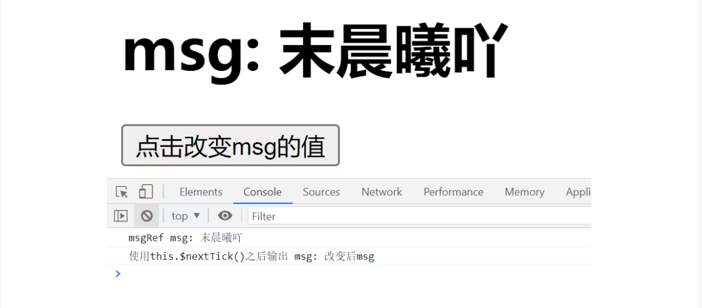
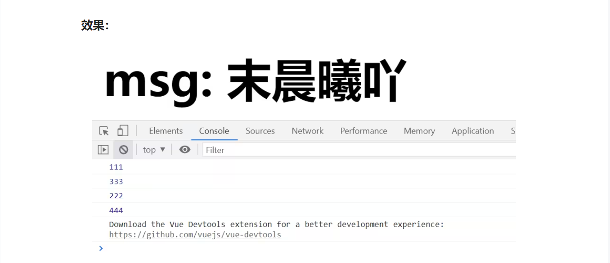

#### $nextTick()方法

##### Vue异步更新策略

在数据发生变化时，vue不会立刻更新DOM，而是开启一个队列，把组件更新函数保存在队列中,也就是说：Vue在更新 DOM 时是异步执行的。

在同一时间循环中发生的所有数据变更都保存在队列，一次性清空队列，一次性更新。

__this.$nextTick(回调函数)__

这个函数就是处理vue中DOM的异步更新的，在数据发生改变时，渲染DOM之后，会自动执行回调函数。

>示例代码：

```vue
<template>
 <div id="app">
 <h1 ref="msgRef">msg: {{ msg }}</h1>
 <button @click="change">点击改变msg的值</button>
 </div>
</template>

<script>
export default {
 name: 'App',
 data(){
 return {
 msg:'末晨曦吖',
 }
 },
 methods:{
 change() {
 // 改变msg的值
 this.msg = '改变后msg值'

 // 输出节点的内容，这个时候虽然数据改变了，但DOM还没有更新，所以取到的还是msg之前的值 末晨曦吖
 console.log('msgRef', this.$refs.msgRef['innerHTML']);

 this.$nextTick(() => {
 // 使用this.$nextTick()之后，里面的内容在DOM更新之后执行，所以取到的是msg修改之后的值
 console.log('使用this.$nextTick()之后输出', this.$refs.msgRef.innerHTML);
 });
 }
 }
}
</script>
```

>效果：



__解释：__

1. 主要看输出部分：这个输出取到的是页面DOM的值，直接输出的话是改变之前的值，虽然数据发生改变，但这时DOM值还没有变，取DOM值是 '末晨曦吖'。

2. 而使用`this.$nextTick()`后，this.$nextTick()的回调函数在渲染完DOM后自动执行，所以这时的DOM值也已经改变了。所以取到的是新的值  “改变后msg值”。 

>个人理解：

个人感觉它的适用场景是：如果希望自己有了某一步操作，就去立即更新dom，那可以在这个方法里再放入一个`$nextTick()`方法。
（我的猜想：按vue的逻辑：所有数据变更都保存在队列，一次性更新，可是有些场景偏偏就只需要部分更新，所以vue开发者才想到创造一个方法来实现部分更新的情况？所以就有了$nextTick()？然后再反推回来，如果有需要部分更新的地方，那就能使用这个方法，就验证了我的个人理解。）

>注意事项：

虽然`$nextTick()`方法可以解决异步更新导致的问题，但如果过度使用该方法会导致性能问题。因此，在实际开发中，__只有在必要的情况下__ 才应该使用 $nextTick() 方法。

##### 常见场景执行顺序：

```vue
<template>

 <div id="app">

 <h1 ref="msgRef">msg: {{ msg }}</h1>

 <button @click="change">点击改变msg的值</button>

 </div>

</template>

<script>
export default {
 name: 'App',
 data(){
 return {
 msg:'末晨曦吖',
 }
 },
 created(){
 console.log(111);
 // 等DOM创建之后才会执行
 this.$nextTick(() => {
 console.log(222);
 });
 },
 mounted(){
 console.log(333);
 this.$nextTick(() => {
 console.log(444);
 });
 },
 methods:{
 change() {
 // 改变msg的值
 this.msg = '改变后msg值'

 // 输出节点的内容，这个时候虽然数据改变了，但DOM还没有更新，所以取到的还是msg之前的值 末晨曦吖
 console.log('msgRef', this.$refs.msgRef['innerHTML']);

 this.$nextTick(() => {
 // 使用this.$nextTick()之后，里面的内容在DOM更新之后执行，所以取到的是msg修改之后的值

 console.log('使用this.$nextTick()之后输出', this.$refs.msgRef.innerHTML);

 });
 }
 }
}
</script>
```

>效果：



__解释：__

1. created()会先执行，没有生成DOM， 所以created()中的`this.$nextTick()`没有执行，继续向下执行mounted()中的内容，所以会先输出333，这时页面中DOM生成，执行created()中this.$nextTick()的回调函数，输出222。 

2.2、响应式数据变化后获取DOM更新后的状态，比如新增或删除列表后，希望获取列表更新后的高度等场景，都可以使用`this.$nextTick()`。