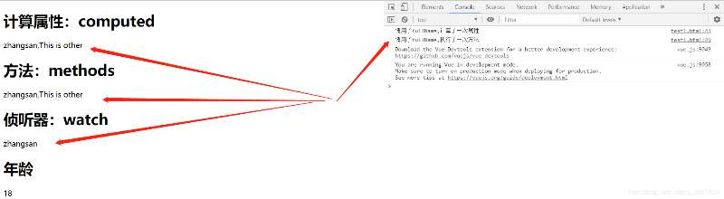
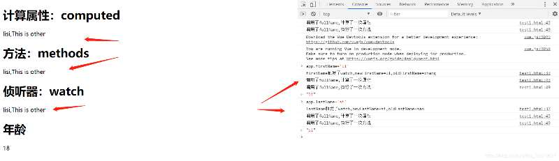
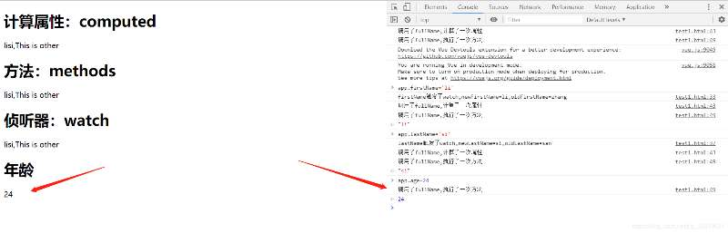
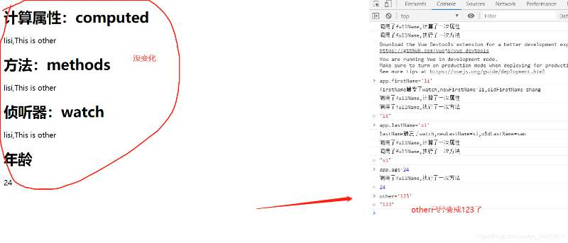
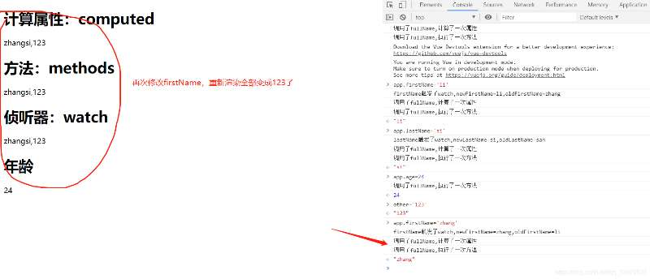

#### 详谈计算属性

##### 计算属性的定义

计算属性是Vue应用程序中的一个数据对象，它提供了一个便捷的方法来处理基于数据的复杂计算和逻辑操作。计算属性本身是响应式的，它们会在相关的数据发生更改时自动重新计算并更新。

##### 计算属性和方法的异同点

1）methods中的方法在模板中被调用，如果这个方法依赖data，data的值发生了变化，这个方法就会重新执行；计算属性也具备这个特性。保证data中数据与页面中显示的数据保持一致！

2） 计算属性计算出来的结果会被缓存起来，下次无需计算直接显示，而方法不是，每次调用都会重新执行。

```html
 <div id="app">
    <!-- 方法 -->
    <h2>{{getFullName()}}</h2>
    <!-- 计算属性 -->
    <h2>{{fullName}}</h2>
  </div>
```
```js
 computed: {
        fullName:function(){
          return this.firstName + " " + this.lastName
        }
      },
      methods: {
        getFullName(){
          return this.firstName + " " + this.lastName
        }
      },
```

   例子中计算属性computed看起来和方法似乎一样，只是方法调用需要使用()，而计算属性不用，方法取名字一般是动词见名知义，而计算属性是属性是名词，但这只是基本使用。

##### 计算属性&侦听器

```html
<!DOCTYPE html>
    <html lang="en">
    <head>
        <meta charset="UTF-8">
        <meta name="viewport" content="width=device-width, initial-scale=1.0">
        <meta http-equiv="X-UA-Compatible" content="ie=edge">
        <title>Vue计算属性/侦听器/方法比较</title>
        <script src="https://cdn.jsdelivr.net/npm/vue@2.6.10/dist/vue.js"></script>
    </head>
    <body>
        <div id="app">
            <h1>计算属性：computed</h1>
            {{fullName}}
            <h1>方法：methods</h1>
            {{fullName2()}}
            <h1>侦听器：watch</h1>
            {{watchFullName}}
            <h1>年龄</h1>
            {{age}}
        </div>
        <script>
            var other = 'This is other';
            var app = new Vue({
                el:"#app",
                data:{
                firstName:"zhang",
                lastName:"san",
                watchFullName:"zhangsan",
                age:18,
                },
                watch: {
                    firstName:function(newFirstName, oldFirstName){
                        console.log("firstName触发了watch,newFirstName="+newFirstName+",oldFirstName="+oldFirstName)
                        this.watchFullName = this.firstName+this.lastName+","+other
                    },
                    lastName:function(newLastName, oldLastName){
                        console.log("lastName触发了watch,newLastName="+newLastName+",oldLastName="+oldLastName)
                        this.watchFullName = this.firstName+this.lastName+","+other
                    }  
                },
                computed: {
                    fullName:function(){
                    console.log("调用了fullName,计算了一次属性")
                    return this.firstName+this.lastName+","+other;
                    }
                },
                methods: {
                    fullName2:function(){
                        console.log("调用了fullName,执行了一次方法")
                        fullName2 = this.firstName+this.lastName+","+other;
                        return fullName2;
                    }
                }
            });
        </script>
    </body>
    </html>
```

>初始化：



>修改firstName/lastName/两者都修改:



>修改computed中没计算的age:



>修改Vue实例外的对象:



>修改Vue实例外对象后在修改Vue实例内的对象:



>测试结论：

1. 使用computed计算了fullName属性，值为firstName+lastName。计算属性具有缓存功能，当firstName和lastName都不改变的时候，fullName不会重新计算，比如我们改变age的值，fullName的值是不需要重新计算的。

2. methods并没有缓存特性，比如我们改变age的值，fullName2()方法会被执行一遍。

3. 当一个功能可以用上面三个方法来实现的时候，明显使用computed更合适，代码简单也有缓存特性。

4. 计算属性范围在vue实例内，修改vue实例外部对象，不会重新计算渲染，但是如果先修改了vue实例外对象，在修改vue计算属性的对象，那么外部对象的值也会重新渲染。

>计算属性&侦听器

__计算属性__ 范围在Vue实例的fullName内所管理的firstName和lastName,通常监听多个变量。

__侦听器__ 监听数据变化，一般只监听一个变量或数组。

>使用场景

watch(异步场景)，computed(数据联动)

#####  计算属性语法

```js
// 从仓库中获取
 computed: {
    userInfo() {
      return this.$store.state.user.userInfo
    },
    // 亦或者
     userInfo：function() {
      return this.$store.state.user.userInfo
    },
  },
//   
```

```js
// 当前页面定义属性
  data: {
    message: 'Hello Vue.js!'
  },
  computed: {
    reversedMessage: function() {
      return this.message.split('').reverse().join('')
    }
  }

// 在上面的例子中，我们定义了一个计算属性reversedMessage，它获取message的值，然后将其翻转并返回。通过在Vue实例中调用computed属性，我们定义了计算属性并指定它所依赖的数据属性。
```

##### 计算属性的优点

1. 计算属性会进行缓存。

计算属性的一个重要特性是它们会进行缓存。如果一个计算属性所依赖的数据属性没有发生更改，那么该计算属性的值也不会重新计算。这种缓存可以大大提高Vue应用程序的性能。

2. 计算属性可以减少模板中的代码。

当我们需要进行复杂的数据计算或逻辑操作时，计算属性可以让我们将这些操作抽象出来，使模板中的代码更加简洁易懂。

3. 计算属性可以与其他计算属性共享。

计算属性可以被其他计算属性所依赖，这使得我们可以构建更加灵活和可重复利用的代码结构。

##### 一些常见的Vue计算属性应用场景：

1. 过滤和排序

```js
// 定义了一个名为filteredList的计算属性，它会返回一个过滤和排序后的list数据。
computed: {
  filteredList: function() {
    return this.list.filter(function(item) {
      return item && item.name && item.name.trim() !== ''
    })
    .sort(function(a, b) {
      return a.name.toLowerCase() > b.name.toLowerCase()
    })
  }
}
```

2. 格式化数据

```js
// 使用计算属性来格式化数据，例如格式化货币、日期和时间等。
computed: {
  formattedPrice: function() {
    return '$' + this.price.toFixed(2)
  },

  formattedDate: function() {
    return moment(this.date).format('MMMM D, YYYY')
  }
}
```

3. 计算属性的getter和setter

我们可以利用计算属性的getter和setter方法来实现更加灵活的属性计算。例如，我们可以定义一个计算属性，当我们为它赋值时，它将自动更新相关的数据。

```js
// 定义了一个名为fullName的计算属性，它具有getter和setter方法。当我们获取该属性时，它会将firstName和lastName组合成一个完整的名称；而当我们将该属性设置为某个新值时，它会将该值分割为名和姓，并在firstName和lastName属性上自动更新。
computed: {
  fullName: {
    get: function() {
      return this.firstName + ' ' + this.lastName
    },
    set: function(newValue) {
      var names = newValue.split(' ')
      this.firstName = names[0]
      this.lastName = names[names.length - 1]
    }
  }
}

// 页面调用
<div>{{fullName('付方方')}}</div>
```
