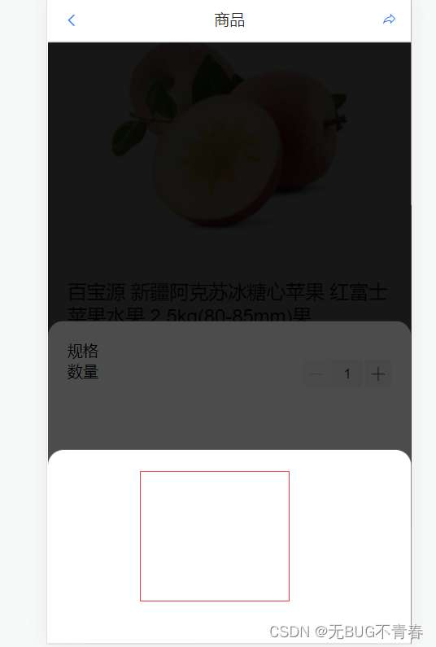

#### 前端生成二维码---QRCode.js

##### 简介

QRCode.js是一个通过js生成二维码图片的插件。通过引用这个js，前端可以很方便的生成二维码图案，不需要再通过后端进行生成调用，大大的节省了时间和资源。

##### 使用方法

>第一步：安装

```bash
npm i qrcodejs --sava
```

>第二步：页面引入

```bash
import QRcode from "qrcodejs2";
```

>第三步：设置id

```html
<!-- 要在哪里展示二维码，就在那里放一个标签，这个标签要有id属性，生成二维码要用~ -->

<div id='qrcode'></div>
```

>第四步：生成二维码

```js
// 简单写法
new QRCode(document.getElementById('qrcode'),'要生成的二维码链接（就是配置参数里面的text）');

// 如果需要配置参数
 qrcode() {
 new QRcode("qrcode", {
 text: "https://www.baidu.com", //需要转换为二维码的内容
 width: 100, //宽
 height: 100,//高
 });
 },
// 运行结果成功的话，就会显示一个二维码
```

##### 常见问题

>报错详情:Error in mounted hook: “TypeError: Cannot read properties of null (reading ‘appendChild’)”




__分析问题：__ 如果二维码放在了弹出层等或某些条件中，导致首次渲染页面，渲染不到二维码部分。调用qrcode方法就找不到id为qrcode的块，所以报错。

__解决问题：__ 添加watch监听方法，dom渲染结束再触发方法。

```js
 watch: {
 // 比如说一个弹出层有showpay控制，起初showpay为false，当showpay为true时，再次加载生成二维码的方法，二维码可正常展示。
 showpay: function () {
 //materielId为需要监听的data
 this.$nextTick(function () {
 if (this.showpay) {
 //这里写方法
 this.qrcode();
 }
 });
 },
 },
```

##### 补充：参数介绍

1. new QRCode(ele,opt)

|参数名称|默认值|参数说明|
|--|--|--|
|ele|-|生成二维码所在元素的id|
|opt|-|二维码参数|

2. 二维码配置参数

|参数名称|默认值|参数说明|
| -- | -- | -- |
|width |256|	二维码图像的宽度|
|height |256| 二维码图像的高度|
|typeNumber|4|
|colorDark|“#000000”|	前景色|
|colorLight|“#ffffff”|	背景色|
|correctLevel|QRCode.CorrectLevel.L|容错级别，可设置为： QRCode.CorrectLevel.L，QRCode.CorrectLevel.M，QRCode.CorrectLevel.Q，QRCode.CorrectLevel.H|

3. API接口

|参数名称|参数说明|
| -- | -- |
|makeCode(text)| 设置二维码内容（text:新的内容）(如果text和之前的内容一样，那就起到一个刷新功能)|
|clear()	|清除二维码。（仅在不支持 Canvas 的浏览器下有效）|