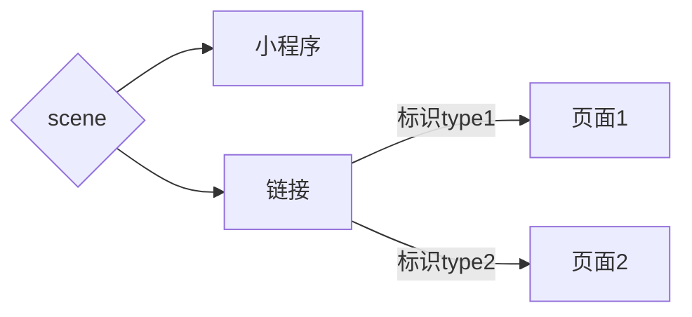

#### 小程序常使用的平台

[小程序使用的ui组件](https://vant-ui.github.io/vant-weapp/#/home)

[小程序-微信官方平台](https://developers.weixin.qq.com/miniprogram/dev/api/)

[微信公众平台](https://mp.weixin.qq.com/)

#### 点击某一按钮，获取用户手机号

- 条件一：button按钮上有一个open-type属性，让open-type="getPhoneNumber"

- 条件二：button按钮上有个bindgetphonenumber属性，让bindgetphonenumber="getPhoneNumber"

>示例代码如下：

```html
 <van-button  open-type="getPhoneNumber" bindgetphonenumber="getPhoneNumber">
          获取手机号
        </van-button>

```

```js
getPhoneNumber(e){
console.log(e)
}
```

>示例图如下：


#### 以链接的方式，跳转到小程序

- 后端会生成一个链接供跳转，前端需要做的是：判断是否通过链接跳转到的小程序（因为还有扫码跳转的，需要做区分）

- 微信官方文档->开发->框架->场景值。你会发现场景值（scene）等于1194的时候，说明是链接跳转进来的。

- 如果是扫码的话，取场景值是在页面初始化完成的时候（onLoad()），从options中取，链接是场景值，需要调用wx.getLaunchOptionsSync()获取。

>示例代码如下：

```js
  onLoad(options) {
// 链接进入小程序，这里取不到
    console.log('option', options)
    //调用方法，获取场景值
    var op = wx.getLaunchOptionsSync()
    console.log('打印微信方法获取的整个对象', op)
    const scene=op.scene
    console.log(scene)//1194
  }
```

>示例图如下：


>项目中遇到的问题：

1. 用场景值来判断是否从链接跳转，风险很大，因为稍微有一点变化，场景值就会变。比如单纯从链接跳转，场景值是1194，而将链接地址嵌入h5标签里，再打开，但是场景值是1167。

   __解决方案__：先区分去小程序码还是链接，这个通过onLoad（options）中的options.scene区别，链接进入是没有scene的（但是调用微信方法：getLaunchOptionsSync()可以获得。）。通过链接跳转到多个页面，可以在链接中加个参数，比如type=1，跳转到A页面，type=2，跳转到B页面。如图：




#### 推送订阅消息

- 登录微信公众平台，版本管理去创建一个推送的版本，得到一个版本id（temid）（这个也可以公司创建好之后，拿来用）

- 调用微信一个方法：wx.requestSubscribeMessage(),调起小程序订阅消息界面，返回订阅消息的操作结果。

__注意__：2.8.2 版本开始，用户发生 __点击行为__ 或者 __发起支付回调__ 后，才可以调起订阅消息界面。

>示例代码如下：

```js
// 先拿到推送消息的模板id
const temid='vi13iDBP0cxfBaT5305OYGQdpA6EC6WadKwqH92FoHA'

  wx.requestSubscribeMessage({
        tmplIds: [temid],
        success(res){
          console.log(res)
        }
      })
```

>示例图如下：


>项目中遇到的问题

1. 一次性订阅模板，勾选‘总是保持以上选择’，微信推送消 息仅有几次，而不是每次

  __答:__ 小程序推送消息本身逻辑：
  1.勾选"总是保持以上选择"，其实也是订阅消息一次，第二次发送消息便会返回错误信息43101；

  2.勾选"总是保持以上选择"只是下次用户订阅消息不再弹窗，用户点击一次订阅一次，始终保持上次勾选的允许与否，在小程序右上角进入设置-->订阅消息 看到的均为“接收”为什么收不到消息那是应为订阅消息次数已用完，所以返回43101

2. 推送模板弹窗以后，用户并没有点击允许或者不允许，而是点击右上角设置里面，直接设置不接收推送，这种情况下，可能会造成后续程序无法执行，一直卡在当前页面。

  __答:__ 利用微信中getSetting（）方法。设置属性 withSubscriptions: true,当返回结果中mainSwith为false时，直接跳过弹出订阅消息，往下走。示例代码如下：

```js
  // withSubscriptions 只返回用户勾选过订阅面板中的“总是保持以上选择，不再询问”的订阅消息。

 <!-- mainSwitch为订阅消息总开关，就是设置里允不允许推送，--mainSwitch: true,说明用户允许推送，那就弹出订阅消息模板，如果为false，说明用户已经修改了设置，不允许推送了，直接跳过弹出模板，往下执行 -->

 const temid='vi13iDBP0cxfBaT5305OYGQdpA6EC6WadKwqH92FoHA'

 wx.getSetting({
        withSubscriptions: true,
        success (res) {

          if (res.subscriptionsSetting.mainSwitch) {

            wx.requestSubscribeMessage({
              tmplIds: [temid],
              success(res){

              }
            })
          }else{

          }         
        }
      })
```

#### 小程序下拉刷新

小程序在刷新页面时，主要有两种方式。

##### 拉动页面刷新（手动刷新）

- 在json文件中将enablePullDownRefresh设置为true，在Page中监听onPullDownRefresh事件即可。支持点击顶部标题栏回到顶部，自定义标题栏时会失效。

```json
{
  "enablePullDownRefresh": true
}
```

```js
// 页面监听下拉刷新

onPullDownRefresh(){
 console.log('下拉刷新了'),
//  如果需要下拉刷新数据，把数据或者接口写到此处
},
```

>弊端

仅在json中配置，下拉刷新是没有任何效果的，就说页面下移了而已，可以配合小程序的方法：showNavigationBarLoading()和showNavigationBarLoading()，代码如下：

```js

Page({


  refreshPage: function () {
    wx.showNavigationBarLoading() // 显示导航条加载动画

    // 可在这里调用接口或更新某种数据

 this.setData({
      // 更新数据
    })


// 更新完之后，调用一个定时器，给用户以提示，如果没有定时器，将隐藏导航栏和显示导航栏都写在refreshPage函数下，会出现没有效果，即导航条还没来得及显示，就已经被隐藏了。所以，它俩必不能同步。

    setTimeout(function () {
      wx.hideNavigationBarLoading() // 隐藏导航条加载动画
      wx.showToast({
        title: '刷新成功',
        icon: 'success',
        duration: 2000
      })
    }, 2000);
  }
})


onPullDownRefresh(){
  // 当监测到下拉刷新时，更新数据
 this.refreshData()
},

```

##### API刷新

- 调用wx.startPullDownRefresh()触发下拉刷新事件，产生下拉刷新动画，处理完下拉刷新中的数据更新后调用wx.stopPullDownRefresh()结束动画即可。

```wxml
<button bind:tap='refrash'>点击刷新</button>
```

```js
Page({

refrash(){
  // 开启下拉刷新
  wx.startPullDownRefresh(
     wx.showNavigationBarLoading(),//显示导航条加载动画
    console.log('开始刷新'),

    //有更新数据或者调用接口，写到此处

    this.setData({
      // 更新数据
    })

  )

  setTimeout((function(){
     wx.hideNavigationBarLoading() // 隐藏导航条加载动画
    wx.stopPullDownRefresh()//关闭下来刷新
  }),1000)
},
})
```

>避雷！

- 切记不要在onPullDownRefresh()方法里再去使用wx.startPullDownRefresh(),两者套用会使页面一直处在下拉刷新的状态，永远不会继续往下执行。（本人在套用使用的时候，startPullDownRefresh（）里面写的有接口，导致执行的时候，一直返回数据，直到栈溢出，并没有执行下面的stopPullDownRefresh()）

>总结：

1. 无论是哪种刷新，json中都需要配置  "enablePullDownRefresh": true,否则任何方式的下拉刷新都不会起效果。

2. 如果是手动下拉刷新，在onPullDownRefresh()方法里只有stopPullDownRefresh()即可，如果是API控制的刷新，startPullDownRefresh和stopPullDownRefresh一定要共存。（onPullDownRefresh中以on开头，就是开始，执行，处在某种状态的意思，而startPullDownRefresh中以start开头，也是开始，执行的意思。两个单词要表达的意思，几乎是差不多的，所以为什么要开始两次呢？？）


#### 小程序web-view内嵌的网页，点击按钮，跳转到别的小程序

>思路分析（web-view-->小程序转化为小程序-->小程序）

- [微信官方文档-->web-view-->相关接口1](https://developers.weixin.qq.com/miniprogram/dev/component/web-view.html)

- web-view提供的方法是没有办法直接跳转到别的小程序，但是可以通过打开它的小程序，制作一个中间页，让当前小程序跳转到别的小程序是可以实现的。

大致步骤如下：

1. 点击按钮，执行wx.miniProgram.navigateTo方法，配置要跳转的打开它的小程序路径。（它只能跳转到打开它的小程序。如果这个网页是第三方做的，我们需要把自己写的中间页路径给到第三方，让他们执行下面的方法，进行跳转。）

```js
wx.miniProgram.navigateTo({
 // 跳转页面路径
 url:'/abc/ab/a'
})
```

2. 跳转到当前小程序之后，可以通过wx.navigateToMiniProgram，跳转到另一个小程序。

```js
 wx.navigateToMiniProgram({
 appId: '目标小程序appid',
 path: '目标小程序页面路径',
 //develop开发版；trial体验版；release正式版
 envVersion: 'release', 
 success(res) {
 // 打开成功
 console.log("跳转小程序成功！",res);
 } 
 })

// 如果不知道小程序appId，那也可以使用链接跳转，这种情况默认跳转到小程序首页，代码如下：

 wx.navigateToMiniProgram({
 shortLink:'目标小程序链接',
 //develop开发版；trial体验版；release正式版
 envVersion: 'release', 
 success(res) {
 // 打开成功
 console.log("跳转小程序成功！",res);
 } 
 })


```