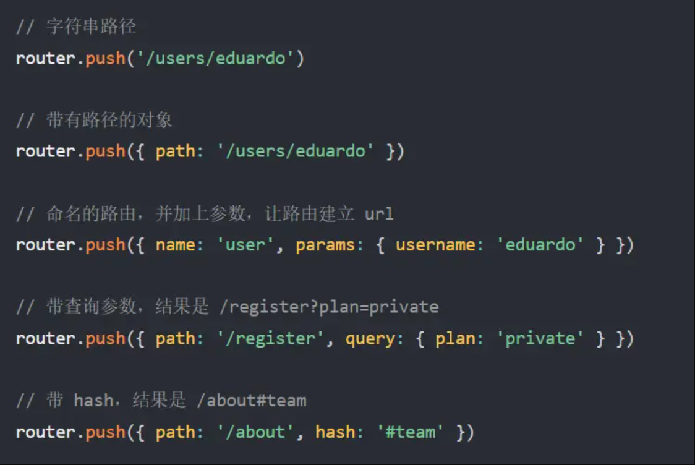
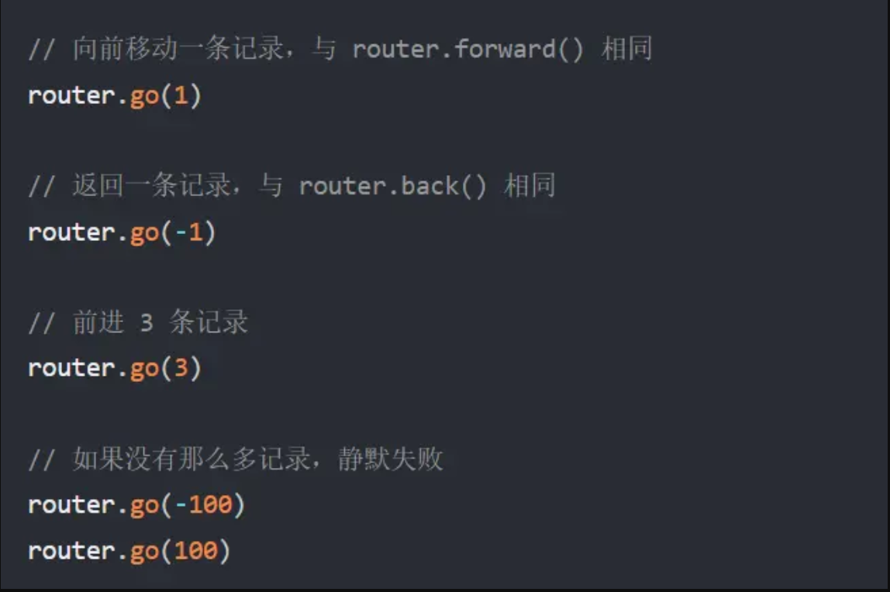

#### this.$router的方法总结

>this.$router.push()

__描述：__ 跳转到不同的url，但这个方法回向history栈添加一个记录，点击后退会返回到上一个页面。

如图：

>this.$router.replace()

__描述：__ 它的作用类似于 router.push，唯一不同的是，它在导航时不会向 history 添加新记录，正如它的名字所暗示的那样——它取代了当前的条目。和push的使用方法一样，具体参考push。

>this.$router.go(n)

__描述：__ 该方法采用一个整数作为参数，表示在历史堆栈中前进或后退多少步，类似于 window.history.go(n)。

<!-- 先总结常用的三种，未完待续......... -->